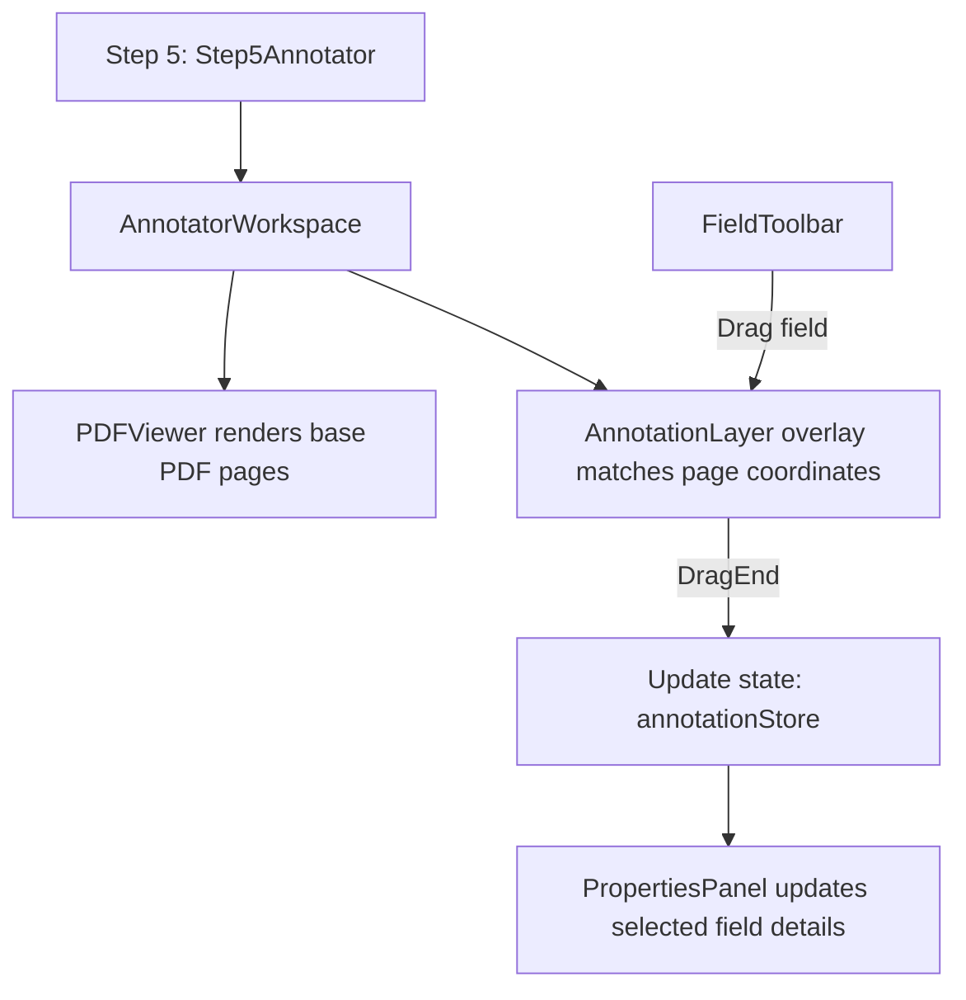
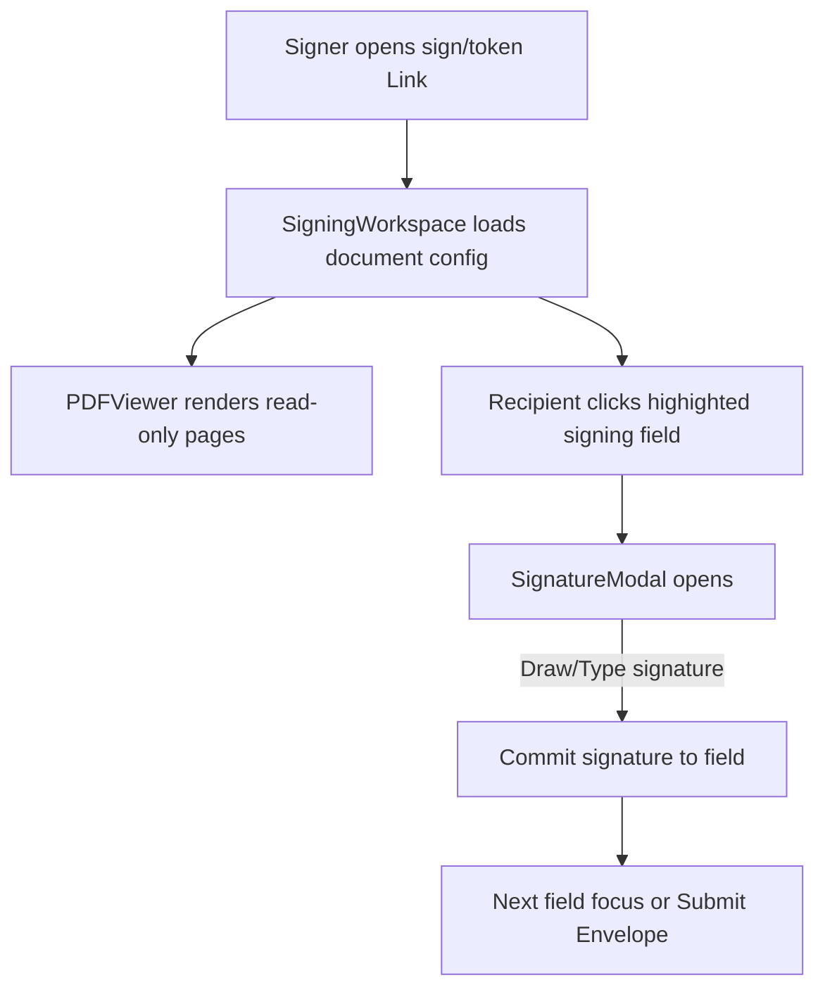

# E-Signature Application Architecture & Folder Structure

This document provides a comprehensive, professional explanation of the project structure, design patterns, and file responsibilities for the E-Signature application. It serves as a guide for development, scaling, and maintaining clean code separation.

---

## 🏗️ Architectural Pattern: Feature-Driven modular Design

This project adopts a **Feature-Driven Modular Architecture** combined with the **Next.js App Router**. Instead of grouping files solely by technical types (e.g., placing all components in one folder, all hooks in another), we modularize code by **business domain features**. 

### Core Benefits
* **High Cohesion, Low Coupling**: Code related to a specific domain (like signing or annotating) is kept together, making it easier to modify, debug, and understand.
* **Scalability**: New features can be added without bloating global folders.
* **Separation of Concerns**: Shared resources (global UI components, utilities) are clearly separated from domain-specific logic.

---

## 📁 Directory Structure Overview

Here is the high-level tree representation of the workspace. This reflects the standard professional setup for a scalable Next.js application:

```text
esignature-app/
├── public/                      # Static assets (images, fonts, vector assets, worker scripts)
├── src/                         # Main source directory
│   ├── app/                     # Next.js App Router (Routes, Page Components, Layouts)
│   │   ├── (auth)/              # Route Group: Auth flows (Login, Register)
│   │   ├── (dashboard)/         # Route Group: Authenticated dashboard flows (Envelopes, Settings, Templates)
│   │   ├── sign/                # Public signing routes (accessed via secure link token)
│   │   ├── globals.css          # Global CSS styles (Tailwind CSS v4 setup)
│   │   ├── layout.tsx           # Global HTML document layout and metadata
│   │   └── providers.tsx        # Global React Context & Query client providers
│   │
│   ├── components/              # Shared, reusable application-wide UI components
│   │   ├── common/              # Shared layouts/widgets (e.g., Command Palette)
│   │   ├── layout/              # Shared app shells (e.g., TopNav, Sidebar)
│   │   └── ui/                  # Atom-level UI primitives (Shadcn UI buttons, inputs, modals)
│   │
│   ├── features/                # Domain-specific feature modules
│   │   ├── annotator/           # PDF Document Annotator workspace (creator side)
│   │   ├── envelope-creator/    # Wizard interface for creating and preparing envelopes
│   │   ├── envelopes/           # List/detail/status components for envelope management
│   │   └── signing/             # Recipient-facing PDF Signing workspace
│   │
│   ├── store/                   # Client-side global state stores (e.g., Zustand)
│   ├── services/                # API client services (network layer / backend communication)
│   ├── lib/                     # Third-party configurations and helper modules
│   ├── types/                   # Shared TypeScript declarations
│   ├── hooks/                   # Reusable React hooks shared across multiple features
│   ├── constants/               # Global constants, static config, and system-wide enums
│   └── provider/                # Shared custom wrapper context providers
│
├── next.config.ts               # Next.js compiler settings and redirects
├── tsconfig.json                # TypeScript compiler configuration
├── tailwind.config.ts / postcss # Tailwind v4 layout styling engine configurations
└── eslint.config.mjs            # Code quality and standard linting rules
```

---

## 🔍 Detailed Folder & File Breakdown

### 1. `src/app/` (Next.js App Router Routing Layer)
This folder defines the application routes based on folders. Files named `page.tsx` represent routing endpoints, while `layout.tsx` files handle layouts for specific route segments.

* **`(auth)/`**: A Next.js **Route Group** (wrapped in parenthesis so it does not affect the URL path). Grouping routes here applies a shared authentication-style layout (like a clean split screen or card design) to all sub-routes.
  * **`layout.tsx`**: Renders the wrapper container, side graphics/branding, and injects children (login/register).
  * **`login/page.tsx`**: Login page UI container, including credentials input and Oauth buttons.
  * **`register/page.tsx`**: Sign-up page UI, handling account registration.
* **`(dashboard)/`**: A Route Group containing all authenticated dashboard features.
  * **`layout.tsx`**: Implements the main dashboard shell, rendering the left sidebar navigation (`Sidebar.tsx`) and standard top nav header (`TopNav.tsx`) with a content area for nested routes.
  * **`page.tsx`**: Main landing dashboard page showing stats (active, completed, drafted envelopes), actions (e.g., "Create New Envelope"), and quick overview cards.
  * **`envelopes/`**: Folder for envelopes routing.
    * **`page.tsx`**: Lists all user envelopes in a table with searching, filtering, and status checks.
    * **`create/page.tsx`**: Renders the multi-step form wizard to create a new envelope (adds files, signers, fields).
    * **`[id]/page.tsx`**: Dynamic route showing status details, audit logs, recipient activity, and preview options for a single envelope.
  * **`templates/`**:
    * **`page.tsx`**: Manages saved document templates (pre-configured roles/fields) for rapid reuse.
  * **`prefill/`**:
    * **`page.tsx`**: Allows pre-filling standard text fields or signatures prior to sending.
  * **`signatures/`**:
    * **`page.tsx`**: Allows users to save/draw/upload personal signature styles for quick selection.
  * **`settings/`**:
    * **`page.tsx`**: Application profile, branding adjustments, and notification setups.
  * **`audit-logs/`**:
    * **`page.tsx`**: History logs of system actions (envelopes created, opened, signed).
* **`sign/`**: Dynamic public route (`sign/[token]/page.tsx`) accessed by recipients to review, fill, and sign documents online without logging in.
* **`providers.tsx`**: Declares global client-side wrapper libraries like `@tanstack/react-query` providers, UI theme state, or toast message layers.
* **`globals.css`**: Holds base global CSS and Tailwind CSS v4 variables, import resets, and custom font configs.

---

### 2. `src/features/` (Domain-Driven Business Modules)
This is the heart of the application logic. Features are isolated into domain folders containing their respective custom views, components, and layout blocks.

#### 🖌️ `features/annotator/`
Manages the interactive canvas where owners set up signable areas (Signature, Initials, Date, Custom Inputs) on a PDF document before sending.
* **`AnnotatorWorkspace.tsx`**: Main layout bringing together the toolbar, sidebar, and PDF renderer.
* **`PDFViewer.tsx`**: Orchestrates loading, rendering, and scaling PDF pages using standard PDF engines (like `pdfjs-dist`).
* **`AnnotationLayer.tsx`**: Overlay placed on top of PDF pages to handle dragging, dropping, positioning, and rendering interactive input elements.
* **`FieldToolbar.tsx`**: Toolbox containing drag-and-drop elements (Signature box, Email field, Date signed, Text box, Checkbox).
* **`PropertiesPanel.tsx`**: Contextual sidebar displaying selected field details (assignee selection, validation requirements, element size, and offsets).
* **`ZoomControls.tsx`**: Zooms in/out of the document canvas.
* **`AnnotationList.tsx`**: Navigation sidebar displaying all placed fields ordered by page and role.
* **`AnnotationIcons.tsx`**: Collection of vector path icons representing specific signature/input fields.

#### ⚡ `features/envelope-creator/`
Handles the step-by-step wizard workflow used to compile documents, configure roles, assign fields, and send out envelopes.
* **`EnvelopeWizard.tsx`**: Orchestrates the active step state (e.g., active step index) and back/next actions.
* **`steps/Step1Details.tsx`**: Collects basic envelope properties (Subject, Email Message, Expiration dates).
* **`steps/Step2Documents.tsx`**: Drag-and-drop file upload zone (supporting PDF uploads).
* **`steps/Step3Roles.tsx`**: Configures signers, CC recipients, and signing orders.
* **`steps/Step4FieldDetection.tsx`**: Intelligent layout assistant highlighting potential fields or scanning form structures.
* **`steps/Step5Annotator.tsx`**: Mounts the `AnnotatorWorkspace` feature to place signature boxes specifically linked to the roles configured in Step 3.

#### 📄 `features/envelopes/`
Displays and monitors status details of sent envelopes.
* **`EnvelopeTable.tsx`**: Renders list views displaying document names, creation dates, and statuses.
* **`EnvelopeStatusBadge.tsx`**: Maps the current state (`draft`, `sent`, `delivered`, `signed`, `voided`) to appropriate design badges.
* **`EnvelopeDetail.tsx`**: Detail layout displaying envelope progress, signer verification status, and downloads.

#### ✍️ `features/signing/`
The UI workspace seen by the end recipient completing their signature tasks.
* **`SigningWorkspace.tsx`**: Secure recipient view rendering the read-only PDF and highlighting fields assigned only to them. Automatically navigates to the next required action field.
* **`SignatureModal.tsx`**: Pop-up canvas allowing recipients to draw, type, or upload an image of their signature.

---

### 3. `src/components/` (Shared Presentational Components)
Components in this folder are domain-agnostic UI building blocks.

* **`ui/`**: Low-level "atomic" primitives built on top of Radix UI and Tailwind (often styled/managed via Shadcn CLI). Examples:
  * `button.tsx` (button types and states)
  * `dialog.tsx` / `popover.tsx` (modal frames)
  * `input.tsx` / `textarea.tsx` / `select.tsx` / `checkbox.tsx` (input controls)
  * `table.tsx` (data grids)
  * `card.tsx` (generic layouts)
  * `tabs.tsx` (switching navigation tabs)
  * `badge.tsx` (status styling blocks)
* **`layout/`**: Shared structural page shells.
  * **`Sidebar.tsx`**: Persistent dashboard side menu with navigation links (Envelopes, Templates, Settings).
  * **`TopNav.tsx`**: Top header displaying active location, global search trigger, notifications, and user profiles.
* **`common/`**: Custom generic features like **`CommandPalette.tsx`** (an overlay modal offering fast search and action command routes).

---

### 4. `src/store/` (Global Application State Layer)
This application uses global state managers (like `Zustand`) for interactive drag-and-drop canvases and workflows where props-drilling becomes inefficient.

* **`annotationStore.ts`**: Holds canvas state: active annotations, positions, selections, sizing, scale/zoom multipliers, and history (undo/redo actions).
* **`envelopeStore.ts`**: Local workspace cache for creating envelopes (active step data, document details, uploaded files).
* **`uiStore.ts`**: Manages interface states, such as sidebars open/collapsed, command palette visibilities, and active notification alerts.

---

### 5. `src/services/` (Network Layer)
Organizes all data access code. Features and pages should not call `fetch` or custom clients directly; instead, they consume these services.

* **`envelopeService.ts`**: Consolidates API calls related to envelopes, including file uploads, creating envelopes, updating status, fetching signature tokens, and downloading PDFs.

---

### 6. `src/lib/` (Libraries Config)
Third-party client initializations and system-wide helper configurations.

* **`utils.ts`**: Reusable low-level helpers, such as Tailwind CSS class merger (`cn`).
* **`queryClient.ts`**: Configures global defaults for `@tanstack/react-query` (caching, retries, and invalidations).

---

### 7. `src/types/` (TypeScript Declared Interfaces)
Provides domain models used globally across features and the backend client.

* **`envelope.ts`**: Defines structures for `Envelope`, `Document`, and `Recipient` objects.
* **`annotation.ts`**: Models signature boxes, input positions, types, status (placed/completed), and page indexing details.
* **`signing.ts`**: Models signing session verification details, IP log records, and confirmation payloads.
* **`template.ts`**: Models preset layouts.
* **`role.ts`**: Defines signer roles and permissions.

---

## 📈 Key Data Flow Patterns

### Document Annotation Flow


### Signature Completion Flow (Recipient View)


---

## 💡 Best Practices and Guidelines

1. **Keep `src/components/ui/` pure**: Avoid importing database or API services inside UI files. Keep them purely visual and controlled by props.
2. **Co-locate domain hooks/components**: If a hook or sub-component is only used within the `annotator` feature, place it inside `src/features/annotator/hooks` or `src/features/annotator/components` rather than the global `src/hooks` folder.
3. **Use Absolute Imports**: Always use `@/` path prefixes configured in `tsconfig.json` to keep import lines clean:
   ```typescript
   // Recommended
   import { Button } from "@/components/ui/button";
   import { useAnnotationStore } from "@/store/annotationStore";
   
   // Avoid relative paths
   import { Button } from "../../../../components/ui/button";
   ```
4. **Access APIs through Service Wrappers**: Use methods in `src/services` wrapped with React Query hooks rather than manual fetch calls directly in component files.
